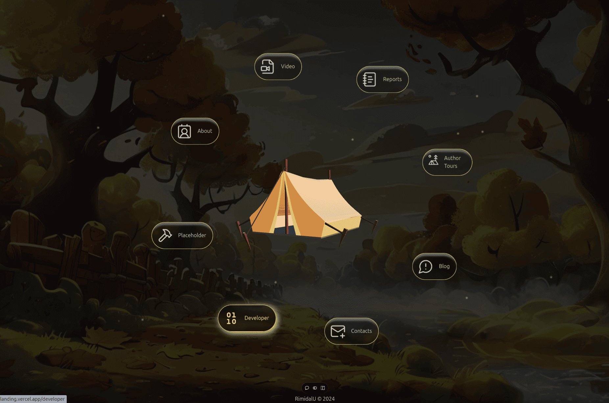
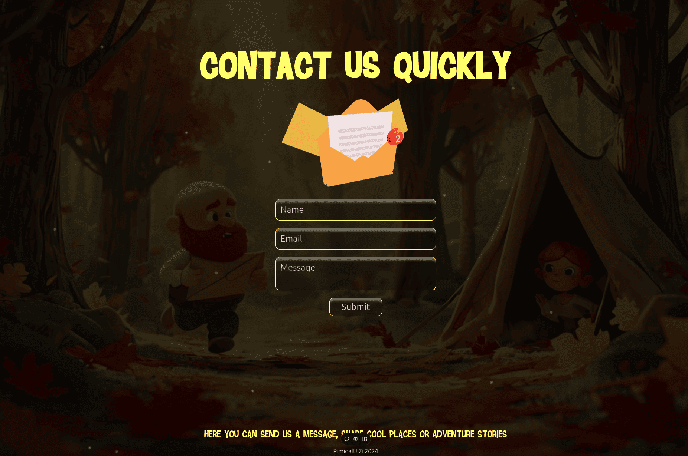
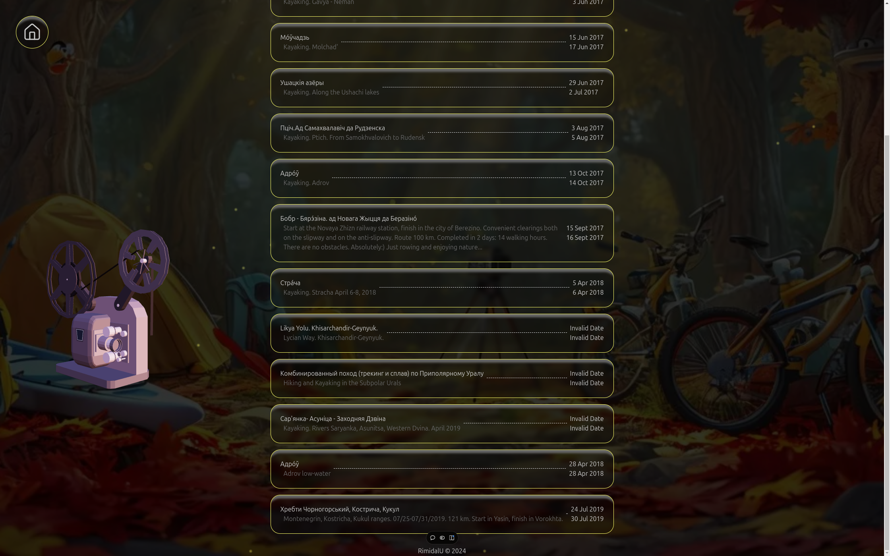
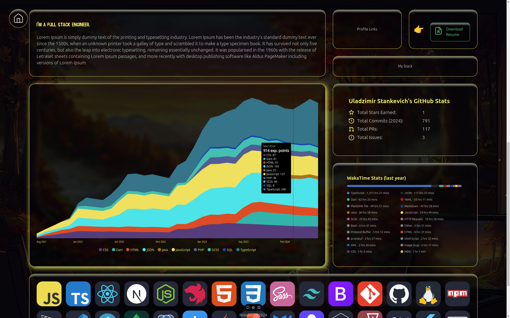

# Travels landing.

> The site contains information about my travels, links to videos about these trips and technical reports.

---

[Description](#description) •
[Project setup](#project-setup) •
[Features](#features) •
[How To Use](#how-to-use) •
[Project Status](#project-status) •
[Room for Improvement](#room-for-improvement) •
[License](#license) •
[Contact](#contact)

## Description

Single page application in Next.js. 

The site contains information about my travels, links to videos about these trips and technical reports...

Stack: Next, TypeScript, TailwindCSS, Emailjs, Three.js.

## Project setup

- Clone this repo to your desktop and run `npm install` to install all the dependencies.
- Once the dependencies are installed, you can run `npm dev` to start the application.
- Enjoy.

## Features

- `react-hook-form` library to work with email form;
- `emailjs` library to send email from browser;
- Web component widget to display codersrank stats;
- Lucid icon library for displaying application icons;
- Sonner toast component;
- ...

## How To Use

Run [Live Demo](https://my-travels-landing.vercel.app/)

<!-- ![tutorial][tutorial] -->

## Project Status

Project is: _in progress_

## Room for Improvement

To do:

- [ ] Add content.
- [ ] Add i18next.
- [ ] Add background music.
- [ ] ...

Improvement:

- [ ] ...

### Credit the Creator:

- "Wild Nature Asset Kit" (https://skfb.ly/on9pF) by Tom Ahawk is licensed under Creative Commons Attribution (http://creativecommons.org/licenses/by/4.0/).
- "Camera" (https://skfb.ly/oDUJu) by Kyn is licensed under Creative Commons Attribution (http://creativecommons.org/licenses/by/4.0/).
- "HW #5 Details | typewriter" (https://skfb.ly/6XN8J) by Tatyana Volkova is licensed under Creative Commons Attribution (http://creativecommons.org/licenses/by/4.0/).
- "Old PC" (https://skfb.ly/6WPFW) by TAb13 is licensed under Creative Commons Attribution (http://creativecommons.org/licenses/by/4.0/).
- "Road Barrier" (https://skfb.ly/6WTBI) by TheMiniFrench is licensed under Creative Commons Attribution (http://creativecommons.org/licenses/by/4.0/).
- "Envelope Low Poly" (https://skfb.ly/oNVTQ) by Artbrakadabra is licensed under Creative Commons Attribution (http://creativecommons.org/licenses/by/4.0/).

### Useful links:

- Generate images: https://playground.com/;
- glb(gtf and other) models: https://sketchfab.com/feed;
- GLTF to JSX: https://github.com/pmndrs/gltfjsx or https://gltf.pmnd.rs/
- threejs editor:  https://threejs.org/editor/
- icons: https://lucide.dev/

## License

This project is open source and available under the [BSD 3-Clause](../LICENSE.md).

## Contact

Created by [@RimidalU](https://www.linkedin.com/in/uladzimir-stankevich/) - feel free to contact me!

<!-- MARKDOWN LINKS & IMAGES -->

<!-- [tutorial]: ./assets/demo.webp -->
