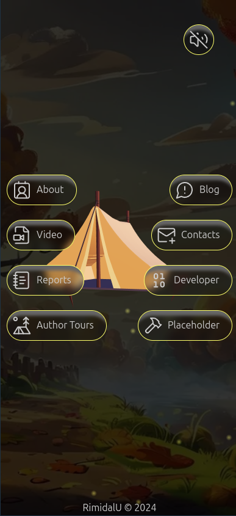
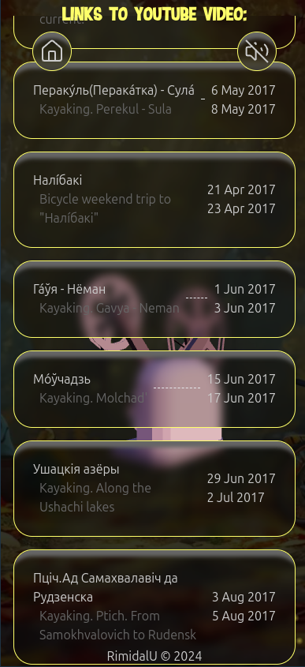
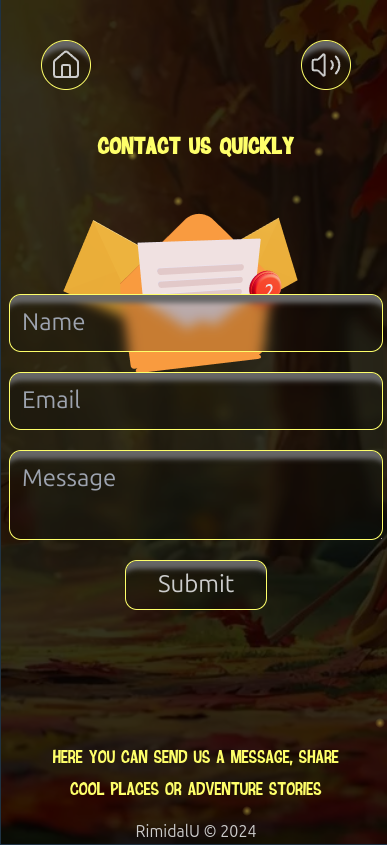
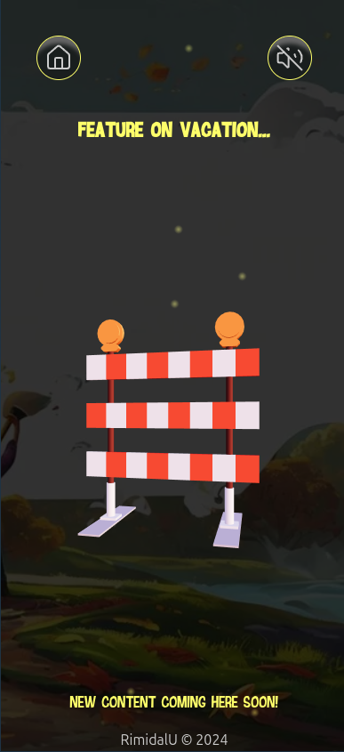

# Travels landing.

> The site contains information about my travels, links to videos about these trips and technical reports.

[](https://my-travels-landing.vercel.app/)


---

[Description](#description) •
[Project setup](#project-setup) •
[Features](#features) •
[How To Use](#how-to-use) •
[Project Status](#project-status) •
[Room for Improvement](#room-for-improvement) •
[License](#license) •
[Contact](#contact)

 
 
   

## Description

Single page application in Next.js.

The site contains information about my travels, links to videos about these trips and technical reports...

Stack: Next, TypeScript, TailwindCSS, Emailjs, Three.js.

## Project setup

-   Clone this repo to your desktop and run `npm install` to install all the dependencies.
-   Once the dependencies are installed, you can run `npm dev` to start the application.
-   Enjoy.

### Project structure

```shell
.
├── .github                         # GitHub folder
├── .husky                          # Husky configuration
├── .vscode                         # VSCode configuration
├── public                          # Public assets folder
├── src
│   ├── app                         # Next JS App (App Router)
│   ├── components                  # React components
│   ├── locales                     # Locales folder (i18n messages)
│   ├── utils                       # Utilities folder
│   └── validations                 # Validation schemas
├── tailwind.config.js              # Tailwind CSS configuration
└── tsconfig.json                   # TypeScript configuration
```

## Features

-   Deploying to Vercel;
-   `react-hook-form` library to work with email form;
-   `emailjs` library to send email from browser;
-   Web component widget to display codersrank stats;
-   Lucid icon library for displaying application icons;
-   Sonner toast component;
-   saving user selection to LocalStorage;
-   background sound with the ability to turn it off;
-   creating content in markdown;
-   rendering content using the `markdown-to-jsx` library;
-   i18n on server and client components;
-   automatic machine translation with `i18nexus`;
-   `husky` and hooks (lint in *pre-commit*, tests in *pre-push*, tips on commit content from openai in *post-push*, check commit message);
-   `jest` tests; 

## How To Use

Run [Live Demo](https://my-travels-landing.vercel.app/)

<!-- ![tutorial][tutorial] -->

## Project Status

Project is: _in progress_

## Room for Improvement

To do:

-   [ ] Add content.
-   [ ] Add i18next.
-   [x] Add background music.
-   [ ] Add project structure to readme file
-   [ ] ...

Improvement:

-   [ ] change select tag layout
-   [ ] ...

### Credit the Creator:

-   "Wild Nature Asset Kit" (https://skfb.ly/on9pF) by Tom Ahawk is licensed under Creative Commons Attribution (http://creativecommons.org/licenses/by/4.0/).
-   "Camera" (https://skfb.ly/oDUJu) by Kyn is licensed under Creative Commons Attribution (http://creativecommons.org/licenses/by/4.0/).
-   "HW #5 Details | typewriter" (https://skfb.ly/6XN8J) by Tatyana Volkova is licensed under Creative Commons Attribution (http://creativecommons.org/licenses/by/4.0/).
-   "Old PC" (https://skfb.ly/6WPFW) by TAb13 is licensed under Creative Commons Attribution (http://creativecommons.org/licenses/by/4.0/).
-   "Road Barrier" (https://skfb.ly/6WTBI) by TheMiniFrench is licensed under Creative Commons Attribution (http://creativecommons.org/licenses/by/4.0/).
-   "Envelope Low Poly" (https://skfb.ly/oNVTQ) by Artbrakadabra is licensed under Creative Commons Attribution (http://creativecommons.org/licenses/by/4.0/).
-   "Ink and Quill" (https://skfb.ly/6TL9T) by Arthur J is licensed under CC Attribution-NonCommercial-NoDerivs (http://creativecommons.org/licenses/by-nc-nd/4.0/).
-   "The voices of birds in the forest" music by <a href="https://pixabay.com/users/sspsurvival-22364443/?utm_source=link-attribution&utm_medium=referral&utm_campaign=music&utm_content=7715">Semen Surin</a> from <a href="https://pixabay.com//?utm_source=link-attribution&utm_medium=referral&utm_campaign=music&utm_content=7715">Pixabay</a>

### Useful links:

-   Generate images: https://playground.com/;
-   glb(gtf and other) models: https://sketchfab.com/feed;
-   GLTF to JSX: https://github.com/pmndrs/gltfjsx or https://gltf.pmnd.rs/
-   threejs editor: https://threejs.org/editor/
-   icons: https://lucide.dev/
-   Automatic Machine Translation i18n: https://i18nexus.com/

## License

This project is open source and available under the [BSD 3-Clause](../LICENSE.md).

## Contact

Created by [@RimidalU](https://www.linkedin.com/in/uladzimir-stankevich/) - feel free to contact me!

<p align="right"><a href="#start"></a></p>

<!-- MARKDOWN LINKS & IMAGES -->

<!-- [tutorial]: ./assets/demo.webp -->
